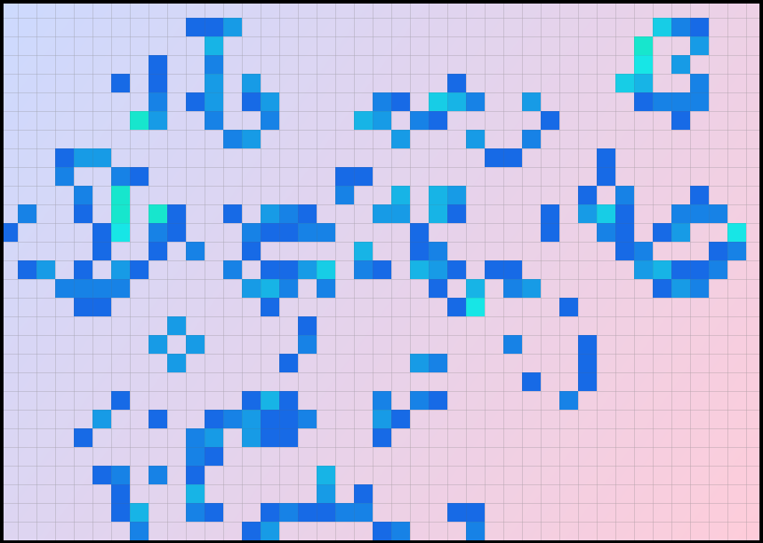
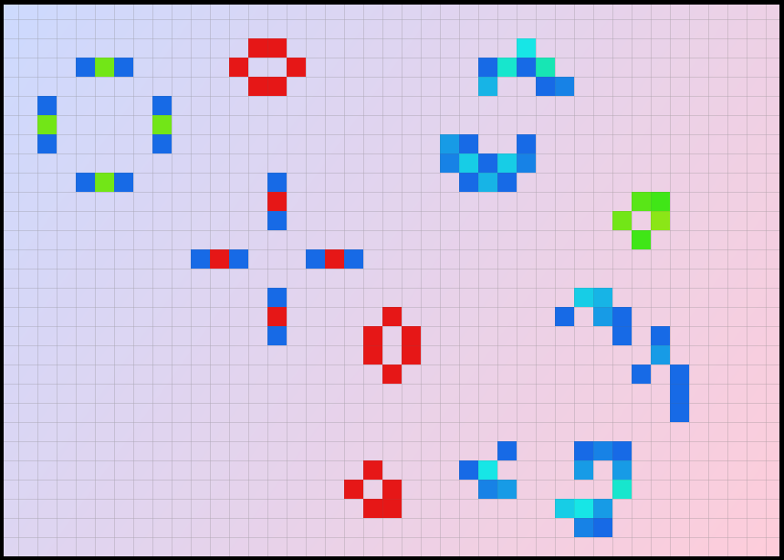

# Yet Another Version of Conway's Game of Life
### ...With a GUI, in Java
*even with ***buttons***.*

and the terrible project structure

### To run just open ```GoL.jar```

#### or build it yourself: ```run.bat``` for Windows or ```run.sh``` for Linux/macOS

You can save configuration to
a file (without an extension), and load it later. Or create your own in this format:
```
400
20,20,0
21,21,0
22,21,0
22,20,0
22,19,0

```

where ```400``` is default field size, ```20,20,0``` is ```x,y,age```, coordinates and age of each cell




